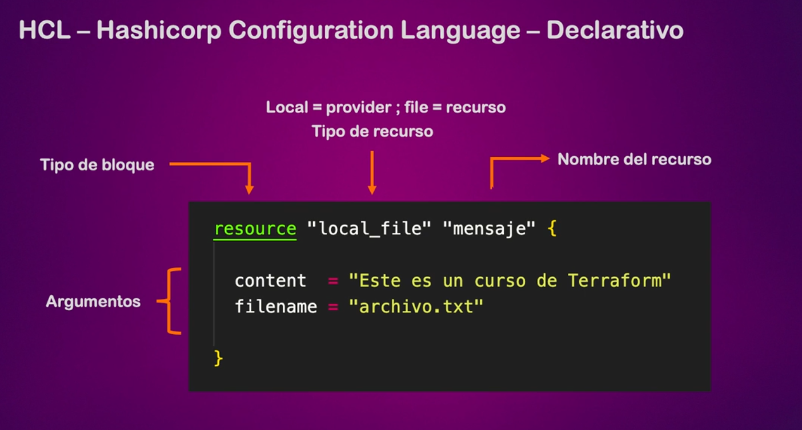
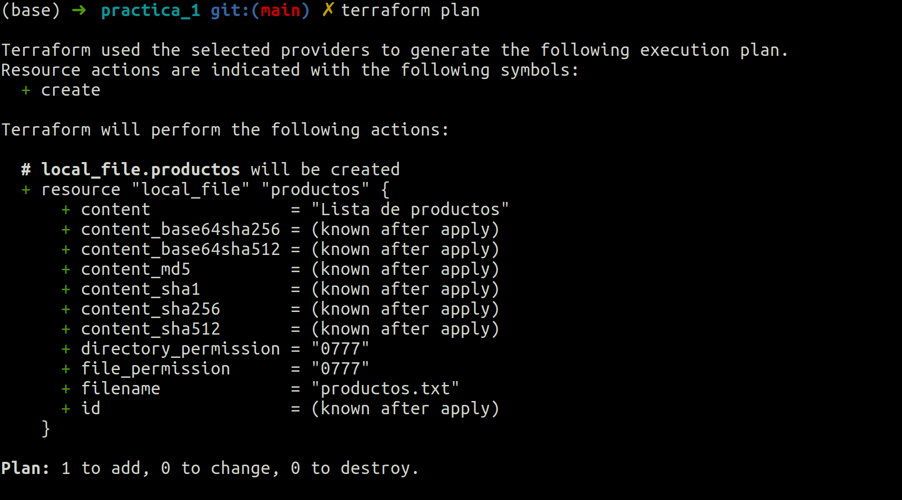
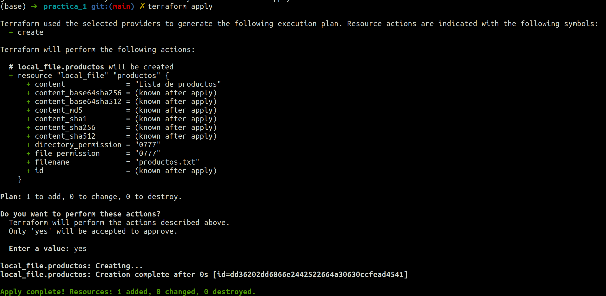
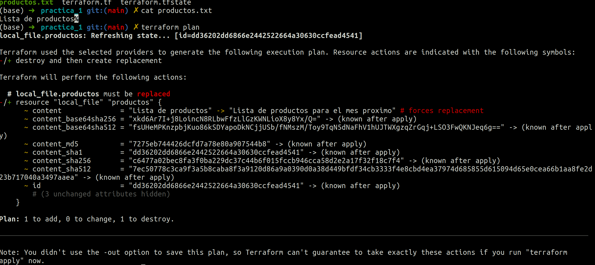
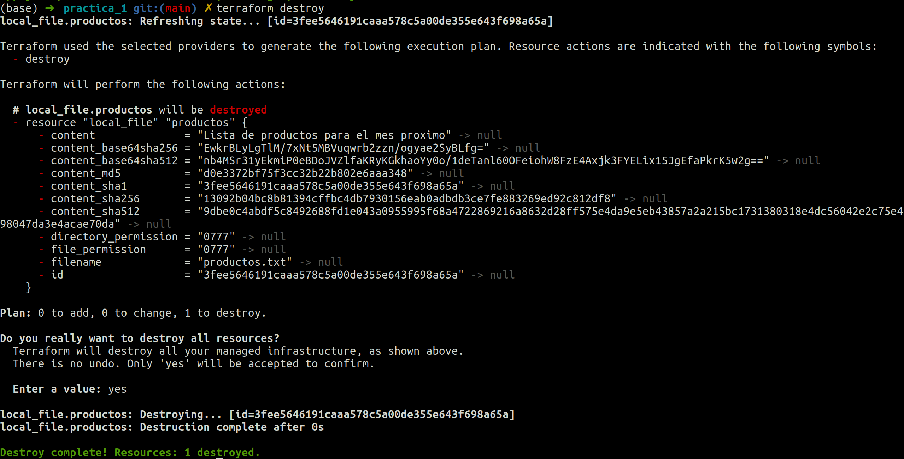

# 1-Intro


1. [Instalar Terraform](#schema1)
2. [ipos de IaC y sus diferentes usos](#schema2)
3. [¿Qués es HCL?](#schema3)
4. [Nuestro primer código](#schema4)

<hr>

<a name="schema1"></a>

## 1. Instalar Terraform

https://developer.hashicorp.com/

https://developer.hashicorp.com/terraform/install

Verificar si esta terraform instalado
```bash
terraform --version
```

<hr>

<a name="schema2"></a>

## 2. Tipos de IaC y sus diferentes usos 

- Ansible y Puppet
  - Su finalidad es intalar y gestionar software
  - Nos permite mantener un estándar en nuestros servidores
  - Podemos tener un control de versiones de nuestros despligues
- IaC orientado a Servidores (Templates) (Docker, pscker, vagrant)
  - Nos permite tener pre-instalado el software y las dependencias necesarias
  - Funciona tanto como para VM como para Contenedores
  - Infraestructura Inmutable
- IaC para aprovisionamiento (Terraform Y AWS CloudFormation)
  - Infraestructura como codigo DECLARATIVO
  - Aprovisionar recursos INMUTABLES  en nuestra infraestructura
  - Toda clase de recuros como instancias, bases de datos, buckets, vpc, etc....
  - Podemos deplyar infraestructura en multiples providers (Terraform)


  <hr>

<a name="schema3"></a>

## 3. ¿Qués es HCL?

HCL - Hashicorp Configuration Language - Declarativo



Donde buscar los recursos que necesitamos para deployar: https://registry.terraform.io/


`local_file`: https://registry.terraform.io/providers/hashicorp/local/latest/docs/resources/file


  <hr>

<a name="schema4"></a>

## 4. Nuestro primer código

[Código](./practica_1/terraform.tf)

### **Ejecutar el código**
```
resource "local_file" "productos" {
  content = "Lista de productos"
  filename = "productos.txt" #path donde se guarda el archivo cread
}
```

- Inicializar:

  ```bash
  terraform init
  ```
- Generar un plan en base a nuestro código
  ```bash
  terraform plan
  ```



- Ejecutar
  ```bash
  terraform apply 
  ```
  Nos ejecuta el código creando primero un plan y luego preguntando si queremos hacerlo.
  

  Nos ha creado una archivo txt, [productos.txt](./practica_1/productos.txt)
  Con la frase que le pusimo en el recurso.

  ### **Cambios en el archivo txt.**

  No podemos cambiar el texto que tiene el archivo `productos.txt` modificando ese archivo tenemos que cambiar el código.


- Generar un plan en base a nuestro código
```bash
terraform plan
```



- Ejecutar
```bash
terraform apply 
```

### **No queremos este código**

```bash
terraform destroy
```
