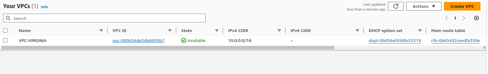

# 1-Intro


1. [Instalar Terraform](#schema1)
2. [ipos de IaC y sus diferentes usos](#schema2)
3. [¿Qués es HCL?](#schema3)
4. [Nuestro primer código](#schema4)
5. [Multiple Providers y definicion de DRY (Don't Repeat Yourself)](#schema5)
6. [Despliegue en AWS](#schema6)
7. [Como guardar y usar un plan](#schema7)
8. [Terraform FMT & Terraform Validate](#schema8)
9. [Restringir las versiones (Constraints) de Terraform & Providers](#schema9)
10. [Uso de Variables en Terraform](#schema100)
11. [Tipos de variables en Terraform](#schema11)
12. [Outputs](#schema12)


[REF](#schemaref)

<hr>

<a name="schema1"></a>

## 1. Instalar Terraform

https://developer.hashicorp.com/

https://developer.hashicorp.com/terraform/install

Verificar si esta terraform instalado
```bash
terraform --version
```

<hr>

<a name="schema2"></a>

## 2. Tipos de IaC y sus diferentes usos 

- Ansible y Puppet
  - Su finalidad es intalar y gestionar software
  - Nos permite mantener un estándar en nuestros servidores
  - Podemos tener un control de versiones de nuestros despligues
- IaC orientado a Servidores (Templates) (Docker, pscker, vagrant)
  - Nos permite tener pre-instalado el software y las dependencias necesarias
  - Funciona tanto como para VM como para Contenedores
  - Infraestructura Inmutable
- IaC para aprovisionamiento (Terraform Y AWS CloudFormation)
  - Infraestructura como codigo DECLARATIVO
  - Aprovisionar recursos INMUTABLES  en nuestra infraestructura
  - Toda clase de recuros como instancias, bases de datos, buckets, vpc, etc....
  - Podemos deplyar infraestructura en multiples providers (Terraform)


  <hr>

<a name="schema3"></a>

## 3. ¿Qués es HCL?

HCL - Hashicorp Configuration Language - Declarativo


Donde buscar los recursos que necesitamos para deployar: https://registry.terraform.io/


`local_file`: https://registry.terraform.io/providers/hashicorp/local/latest/docs/resources/file


  <hr>

<a name="schema4"></a>

## 4. Nuestro primer código

[Código](./practica_1/terraform.tf)

### **Ejecutar el código**
```
resource "local_file" "productos" {
  content = "Lista de productos"
  filename = "productos.txt" #path donde se guarda el archivo cread
}
```

- Inicializar:

  ```bash
  terraform init
  ```
- Generar un plan en base a nuestro código
  ```bash
  terraform plan
  ```


- Ejecutar
  ```bash
  terraform apply 
  ```
  Nos ejecuta el código creando primero un plan y luego preguntando si queremos hacerlo.
  

  Nos ha creado una archivo txt, [productos.txt](./practica_1/productos.txt)
  Con la frase que le pusimo en el recurso.

  ### **Cambios en el archivo txt.**

  No podemos cambiar el texto que tiene el archivo `productos.txt` modificando ese archivo tenemos que cambiar el código.


- Generar un plan en base a nuestro código
```bash
terraform plan
```


- Ejecutar
```bash
terraform apply 
```

### **No queremos este código**

```bash
terraform destroy
```


  <hr>

<a name="schema5"></a>

## 5. Multiple Providers y definicion de DRY (Don't Repeat Yourself)

1. Creamos carpeta de practica_2 y añadimos al código otro bloques de recursos


2. Nuevo provider `Random`: https://registry.terraform.io/providers/hashicorp/random/latest

    Vamos a usar este: https://registry.terraform.io/providers/hashicorp/random/latest/docs/resources/string
    
    ```
    resource "local_file" "productos" {
      content = "Lista de productos para el mes proximo"
      filename = "productos.txt" #path donde se guarda el archivo cread
    }

    resource "random_string" "sufijo" {
      length           = 4
      special          = false
      upper = false
      numeric = false
    }
    ```
    Si hacemos `terraform plan` nos da este error

    ```bash
    Error: Inconsistent dependency lock file
    │ 
    │ The following dependency selections recorded in the lock file are inconsistent with the current configuration:
    │   - provider registry.terraform.io/hashicorp/random: required by this configuration but no version is selected
    │ 
    │ To update the locked dependency selections to match a changed configuration, run:
    │   terraform init -upgrade

    ```
    Porque pasa esto, porque estamos trabajando con un nuevo provider y no hemos ejecutado `terraform init` para que terraform tenga en conocimiento los nuevos providers

    Una vez hecho el `terraform apply` nos genera esto, el archivo `productos-rjjj.txt` que es lo que queríamos. El archivo producto son un sufijo.

    ```bash
    productos-rjjj.txt  terraform.tf  terraform.tfstate  terraform.tfstate.backup
    ```
3. `terraform show`

    Con este comando podemos ver los recursos que terraform ha creado
    

4. Dividir el código en dos archivos `local_file.tf`y `random.tf`. Cuando hacemos `terraform.apply` nos dice que todo sigue igual porque para terraform funciona indistintamente si los providers estan todos es un mismo archivo o en distintos. 
5. Probamos a tener 5 archivos. Modificamos el archivo `local_file.tf` y hacemos `terraform.apply` 
    ```
    resource "local_file" "productos" {
      content = "Lista de productos para el mes proximo"
      filename = "productos-${random_string.sufijo.id}.txt" 
    }
    resource "local_file" "productos" {
      content = "Lista de productos para el mes proximo"
      filename = "productos-${random_string.sufijo.id}.txt" 
    }
    resource "local_file" "productos" {
      content = "Lista de productos para el mes proximo"
      filename = "productos-${random_string.sufijo.id}.txt" 
    }
    resource "local_file" "productos" {
      content = "Lista de productos para el mes proximo"
      filename = "productos-${random_string.sufijo.id}.txt" 
    }
    resource "local_file" "productos" {
      content = "Lista de productos para el mes proximo"
      filename = "productos-${random_string.sufijo.id}.txt" 
    }
    ``` 
    Error por duplicidad del recurso `local_file`
    ```bash
    Error: Duplicate resource "local_file" configuration
    ```
    Hacemos cambio en el codigo
    ```
    resource "local_file" "productos-1" {
    content = "Lista de productos para el mes proximo"
    filename = "productos-${random_string.sufijo.id}.txt" 
    }
    resource "local_file" "productos-2" {
      content = "Lista de productos para el mes proximo"
      filename = "productos-${random_string.sufijo.id}.txt" 
    }
    resource "local_file" "productos-3" {
      content = "Lista de productos para el mes proximo"
      filename = "productos-${random_string.sufijo.id}.txt" 
    }
    resource "local_file" "productos-4" {
      content = "Lista de productos para el mes proximo"
      filename = "productos-${random_string.sufijo.id}.txt" 
    }
    resource "local_file" "productos-5" {
      content = "Lista de productos para el mes proximo"
      filename = "productos-${random_string.sufijo.id}.txt" 
    }
    ```
      Al hacer `terraform apply` solo nos ha creado un solo archivo `productos-cfqg.txt`. Porque estamos referenciando  un recurso `random_string` de cual solo tenemos uno. Solo tenemos un recurso y lo estamos usando en 5 archivo por lo tanto los 5 archivos se llaman igual y por eso solo vemos una.
      ```bash
      local_file.tf  productos-cfqg.txt  random.tf  terraform.tfstate  terraform.tfstate.backup
      ```
      Para poder ver 5 archivos hay que modificar el archivo `random.tf`
      ```
      resource "random_string" "sufijo-1" {
      length           = 4
      special          = false
      upper = false
      numeric = false
      }
      resource "random_string" "sufijo-2" {
        length           = 4
        special          = false
        upper = false
        numeric = false
      }
      resource "random_string" "sufijo-3" {
        length           = 4
        special          = false
        upper = false
        numeric = false
      }
      resource "random_string" "sufijo-4" {
        length           = 4
        special          = false
        upper = false
        numeric = false
      }
      resource "random_string" "sufijo-5" {
        length           = 4
        special          = false
        upper = false
        numeric = false
      }
      ```
      Y actualizar las referencias en el  archivo `local_file.tf`
      Ahora si tenemos los 5 archivos pero esta no es buena práctica. Porque estamos repitiendo mucho código.

6. Probando a no repetir código. Vamos a usar una clausula especial`count`. Con los cambio necesarios tenemos los 5 archivos creados correctamente.
    
  


  <hr>

<a name="schema6"></a>

## 6. Despliegue en AWS

### **Crear un bucket S3**
Documentación:

https://registry.terraform.io/providers/hashicorp/aws/latest/docs
https://registry.terraform.io/providers/hashicorp/aws/latest/docs/resources/s3_bucket

```python
resource "aws_s3_bucket" "proveedores" {
  bucket = "proveedores_regional_patri"
}
```
1. `terraform init`
2. `terraform plan`
3. `terraform apply`


4. `terraform destroy`

### **Crear bucket S3 para crear buckets únicos usando el recurso random_string**

Vamos a crear dos buckets:

```python
resource "aws_s3_bucket" "proveedores" {
  count = 2
  bucket = "proveedores-${random_string.sufijo[count.index].id}"
}


resource "random_string" "sufijo" {
  count  = 2 
  length = 8
  special = false
  upper = false
  numeric = false
}
```
1. `terraform init`, porque hemos añadido un recurso nuevo a nuestro documento, `random_string`
2. `terraform plan`
3. `terraform apply`


### **Añadir `tags` al bucket**
```python
resource "aws_s3_bucket" "proveedores" {
  count = 2
  bucket = "proveedores-${random_string.sufijo[count.index].id}"
   tags = {
    Owner       = "Patri"
    Environment = "Dev"
    Office = "proveedores"
  }
}


resource "random_string" "sufijo" {
  count  = 2 
  length = 8
  special = false
  upper = false
  numeric = false
}
```
1. `terraform plan`
2. `terraform apply`


3. `terraform destroy`


  <hr>

<a name="schema7"></a>


## 7. Como guardar y usar un plan

Para tener una copia del plan, aunque alguien modifique a posteriori los recursos de nuestro archivo.


1. `terraform plan -out s3.plan`
2. `terraform apply "s3.plan"`
3. `terraform destroy`

  <hr>

<a name="schema8"></a>

## 8. Terraform FMT & Terraform Validate

### **`terraform ftm`**
1. `terraform fmt`: formatea el archivo tf. Te formate todos los archivos `.tf` que tengas en la carpeta en la que estas ejecutandose el comando.

2. `terraform fmt terraform.tf`: Solo formatea ese archivo `terraform.tf`

### **`terraform validate`**
1. `terraform validate` : valida que la sintaxis que tenemos en nuestros archivos sean los correctos. Valida todos los archivos de la carpeta.
También podemos hacer `terraform plan`y nos diría si tenemos algo no correcto, pero con la diferencia que tendríamos que esperar que se genere todo el plan para que nos dira los fallos, en cambio el validate es mucho más rápido porque no genera el plan. 


  <hr>
  
<a name="schema9"></a>


## 9. Restringir las versiones (Constraints) de Terraform & Providers


[DOC](https://registry.terraform.io/providers/hashicorp/aws/latest/docs)

Ejemplo:

```python
terraform {
  required_providers {
    aws = {
      source  = "hashicorp/aws"
      version = "~> 5.0"
    }
  }
}

# Configure the AWS Provider
provider "aws" {
  region = "us-east-1"
}

# Create a VPC
resource "aws_vpc" "example" {
  cidr_block = "10.0.0.0/16"
}
```

### **Crear Restricciones con las versiones de terrafor y de aws**

[Codigo](./practica_4/)
1. Creamos archivo `providers.tf` que contiene las restricciones para esta prueba.
2. `terraform init`

    Al poner `required_version = "1.2.0" # version requerida de terraform` nos da un error porque nosotros tenemo versiones distintas.
    
    
    Para solucionarlo una de las opciones es poner la version que tenemos `required_version = "1.9.0" ` y la otra es `required_version = "~>1.9.0"` que indica que cualquier version igual o inferior es válida.

### **Crear VPC**
[DOC](https://registry.terraform.io/providers/hashicorp/aws/latest/docs/resources/vpc)
1. Creams el archivo `vpc.tf`
2. `terraform plan`
3. `terraform apply`



### **Crear VPC en distintas regiones
1. Añadimos en `vpc.tf`
```python
resource "aws_vpc" "vpc_ohio" {
  cidr_block = "10.0.0.0/16"
  tags = {
    Name = "VPC-OHIO"
    env = "Dev"
  }
}
```
Pero si dejamos esto así nos va a desplegar otra vpc con ese nombre no en otra region, por lo tanto hay que modificar el archivo `providers.tf`

Añadiendo este código y poniendo un alias a esa región. Ahora le decimos al recurso cual de las dos regiones tiene que coger.
```python
provider "aws" {
  # Configuration options
  region = "us-east-2"
  alias = "ohio"
}
```
`vpc.tf`
```python
resource "aws_vpc" "vpc_ohio" {
  cidr_block = "10.0.0.0/16"
  tags = {
    Name = "VPC-OHIO"
    env = "Dev"
  }
  provider = aws.ohio
}
```


4. `terraform destroy`

  <hr>
  
<a name="schema10"></a>

## 10. Uso de Variables en Terraform


### **Asignando valores a las variables**

[Codigo](./practica_5/)

Vamos a ver varias opciones:

1. Modificar el archivo `vpc.tf` añadiendo el apartado de variables.
2. Hacemos una prueba donde dejamos el codigo sin default
    ```python
    variable "ohio_cidr" {
    }
    ```
    Cuando ejecutamos `terraform.plan` en ese momento nos pide el valor de esa varible.

    

3. Con variables de entorno.

    Definimos variables de entorno. 
    ```bash 
    export TF_VAR_virginia_cidr="10.0.0.0/16"
    ```
    Podemos ver las variables de entorno con el comando `env | grep TF`
    

    Borrar variables de entornos

    ```bash
    unset TF_VAR_virginia_cidr
    ```

4. Otra forma de añadir las variables es cuando ejecutamos el `terraform plan` o el `terraform apply`.

    -  `terraform plan -var ohio_cdir="10.0.0.0/16"`, poco práctica al tener que meter todas las variables a manos,

5. Archico `.tfvars` la mas recomendada.
    - Creamos el archivo `variables.tf` y copiamos el codigo de las variables que teníamos en `vpc.tf`. Solo ponemos la difinición de las variables no el contenido.
    ```
    variable "virginia_cidr" {
    }
    variable "ohio_cidr" {
    }
    ``` 
    - El contenido va en otro archivo llamado `terraform.tfvars`. Al llamarse así se carga automaticamente al hacer un plan.
    ```
    virginia_cidr = "10.0.0.0/16"

    ohio_cidr = "10.0.0.0/16"
    ```

    

    - El archivo no puede tener cualquier nombre. 
    

6. Prioridades en la definición de variables
    


  <hr>
  
<a name="schema11"></a>

## 11. Tipos de variables en Terraform

### Arguments
Terraform CLI defines the following optional arguments for variable declarations:

- default - A default value which then makes the variable optional.
- type - This argument specifies what value types are accepted for the variable.
- description - This specifies the input variable's documentation.
- validation - A block to define validation rules, usually in addition to type constraints.
- sensitive - Limits Terraform UI output when the variable is used in configuration.
- nullable - Specify if the variable can be null within the module.
### Type:

- Cadena (String):

  Almacena datos de texto.
    
  Ejemplo: "example"
- Número (Number):

  Almacena datos numéricos, pueden ser enteros o de punto flotante.

  Ejemplo: 42, 3.14
- Booleano (Boolean):

  Almacena valores de verdad, true o false.

  Ejemplo: true

- Lista (List):

  Almacena una colección ordenada de valores del mismo tipo.

  Ejemplo: ["apple", "banana", "cherry"]

- Mapa (Map):

  Almacena un conjunto de pares clave-valor donde tanto las claves como los valores son del mismo tipo.

  Ejemplo: { "name" = "John", "age" = 30 }

- Conjunto (Set):

  Almacena una colección no ordenada de valores únicos del mismo tipo. No podemos acceder a elementos puntuales.

  Ejemplo: ["one", "two", "three"] (similar a lista pero sin duplicados)

  ```
  variable "instance_names" {
  type    = set(string)
  default = ["web1", "web2", "web3"]
  }
  ```
  Usando for_each podemos acceder a cada elemento del set

  ```
  provider "aws" {
  region = "us-west-2"
  }

  resource "aws_instance" "example" {
  for_each = var.instance_names

  ami           = "ami-0c55b159cbfafe1f0" # Reemplaza con una AMI válida en tu región
  instance_type = "t2.micro"

  tags = {
    Name = each.key
  }
  }

  output "instance_ids" {
  value = [for instance in aws_instance.example : instance.id]
  }
  ```
- Objeto (Object):

  Almacena una colección de pares clave-valor donde los valores pueden ser de diferentes tipos.

  Ejemplo: { name = "John", age = 30, is_active = true }

- Tuppla (Tuple):

  Almacena una colección ordenada de valores de diferentes tipos.
  
  Ejemplo: ["apple", 2, true]


- Nulo (Null):

  Representa un valor vacío o no asignado.

  Ejemplo: null


  <hr>
  
<a name="schema12"></a>

## 12. Outputs

Las variables de salida permiten a los usuarios extraer datos de los recursos gestionados por Terraform y utilizarlos en otras partes de su configuración o mostrarlos al final de la ejecución. Los outputs son especialmente útiles para compartir información entre diferentes módulos de Terraform o para proporcionar detalles importantes que pueden necesitarse para otras operaciones manuales o automáticas.

### Definición de un Output
Un bloque de salida se define utilizando la palabra clave output. Aquí hay un ejemplo básico:

```hcl
output "instance_ip" {
  description = "The public IP address of the instance"
  value       = aws_instance.my_instance.public_ip
}
```

### Componentes de un Output
- Nombre del Output: `instance_ip` en este caso, es el nombre de la salida. Este nombre se utilizará para referenciar la salida en otras configuraciones de Terraform o en la salida de la terminal.

- Descripción (opcional): `description` proporciona una breve descripción del valor de salida, lo que es útil para documentación y mantenimiento.

- Valor: value es el valor que será exportado. Puede ser una referencia directa a un atributo de un recurso, una expresión, o cualquier otro valor derivado de la configuración de Terraform.


### Attribute Reference

En el apartado Attribute Reference de la documentación del recurso podemos ver todos los atributos que tenemos para añadir como argumentos.


## [Ejemplo practica variables](/practica_6/)

```
sensitive = false
```


```
sensitive = true
```


[DOC AWS_SUBNET](https://registry.terraform.io/providers/hashicorp/aws/latest/docs/resources/subnet)


## [Practica de Outputs](/practica_6/)

[DOC AWS_INSTACES](https://registry.terraform.io/providers/hashicorp/aws/latest/docs/resources/instance)


Vamos a crear unas instacias EC2 en la subnet publica.

```
resource "aws_instance" "this" {
  ami                     = "ami-0dcc1e21636832c5d"
  instance_type           = "m5.large"
  host_resource_group_arn = "arn:aws:resource-groups:us-west-2:012345678901:group/win-testhost"
  tenancy                 = "host"
}
```
Como vemos en el ejemplo anterior necesitamos conocer el `ami` o `Amazon Machine Image` de la instancia EC2 que vamos a crear, por lo tanto vamos a hacer una prueba de creación en la consola de Amazon para ver ese `ami`.


Para poder obtener los outputs también podemos ejecutar el siguiente comando:
```
terraform output
```
Y nos muestran todos los outputs que tenemos, pero si nos sabemos el nombre podemos usar:
```
terraform output ec2_public_ip
```
Y los más importante como ya hemos terminado nuestra práctica, hay que destruir los recursos creados con:

```
terraform destroy
``` 


  <hr>

<a name="schemaref"></a>

REF: https://www.udemy.com/course/hashicorp-terraform/
